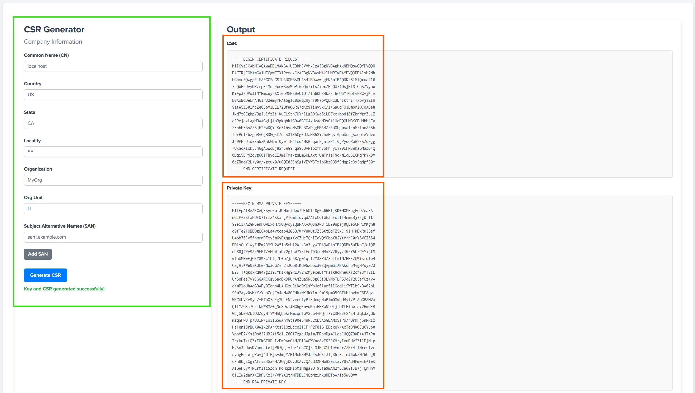

# CSR Generator for Splunk


## Overview

**CSR Generator** is a Splunk app that allows users to generate a Certificate Signing Request (CSR) and a private key directly from a simple dashboard UI inside Splunk. 

The app leverages the OpenSSL binary bundled with Splunk (`splunk cmd openssl`) and is fully compatible with **Windows and Linux environments**.


## Release History

| Date       | Version | Notes                                                                 |
|------------|---------|-----------------------------------------------------------------------|
| 2024-10-04 | 0.0.1   | Initial release                                                       |
| 2024-10-12 | 0.0.2   | Added `subjectAltName` support, improved input handling, bug fixes    |
| 2025-05-21 | 0.1.0   | Major UI/UX redesign, improved CSR engine, full Windows/Linux support |

---

## Dashboard



---

## Syntax

```spl
| gencsr common_name=<string> country=<string> state=<string> locality=<string> organization=<string> organizationalunit=<string> password=<string> subjectaltname=<string>
```

---

## Example

```spl
| gencsr common_name="example.com" country="US" state="CA" locality="San Francisco" organization="Example Inc." organizationalunit="IT" password="securepassword" subjectaltname="www.example.com,mail.example.com"
```

---

## Features

- Generates CSRs using OpenSSL standards.
- Full cross-platform support (Windows and Linux).
- Customizable fields: Common Name (CN), Country (C), State (ST), Locality (L), Organization (O), Organizational Unit (OU), and SubjectAltName (SAN).
- Password protection for the generated private key (PKCS#8 PEM format).
- Secure in-memory handling of key and CSR (temp files are securely deleted).
- Outputs CSR and private key directly to the Splunk UI for easy copy/paste.
- User-friendly dashboard UI with real-time validation and dynamic SAN input.
- Integrated with Splunk SPL as a custom `GeneratingCommand`.

---

## New in Version 0.1.0

- ✅ Complete UI redesign with two-panel layout (form on left, output on right).
- ✅ Dashboard restyled for clarity, readability, and modern UX.
- ✅ Full compatibility with Splunk on Windows (no more stdin issues).
- ✅ Sanitized OpenSSL output (`writing RSA key` line removed).
- ✅ Clear separation between logic, layout, and style (JS / CSS / XML).
- ✅ Responsive design with clean layout for enterprise use.

---

## Known Limitations

- OpenSSL must be available via `splunk cmd openssl`.
- Input validation checks only basic structure (e.g., valid characters in SAN/CN).
- The app executes synchronously — high-volume CSR generation may require performance tuning.
- Some OpenSSL validation errors are surfaced raw from stdout/stderr.

---

## Credits

- Inspired by **MS**

---

## Links

- Feel free to contribute or Fork via [https://github.com/aleeric/CSR-Generator-for-Splunk](https://github.com/aleeric/CSR-Generator-for-Splunk)

- Rate App on Splunkbase via https://splunkbase.splunk.com/app/7567

